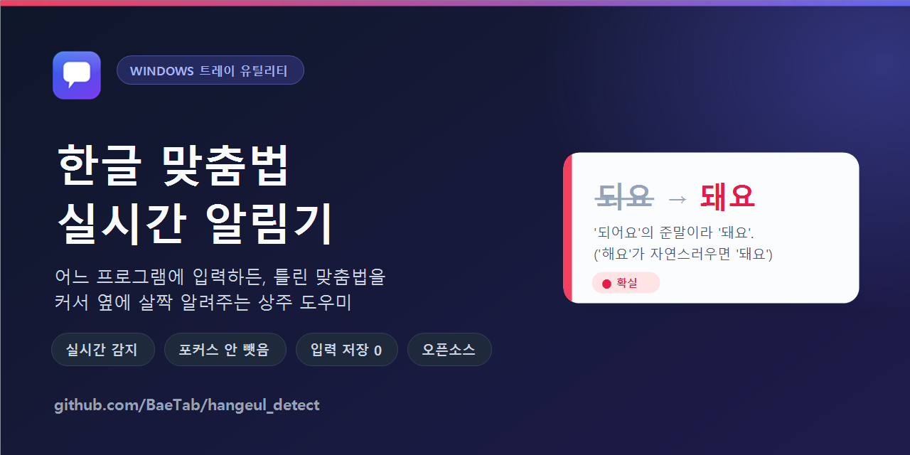
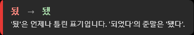
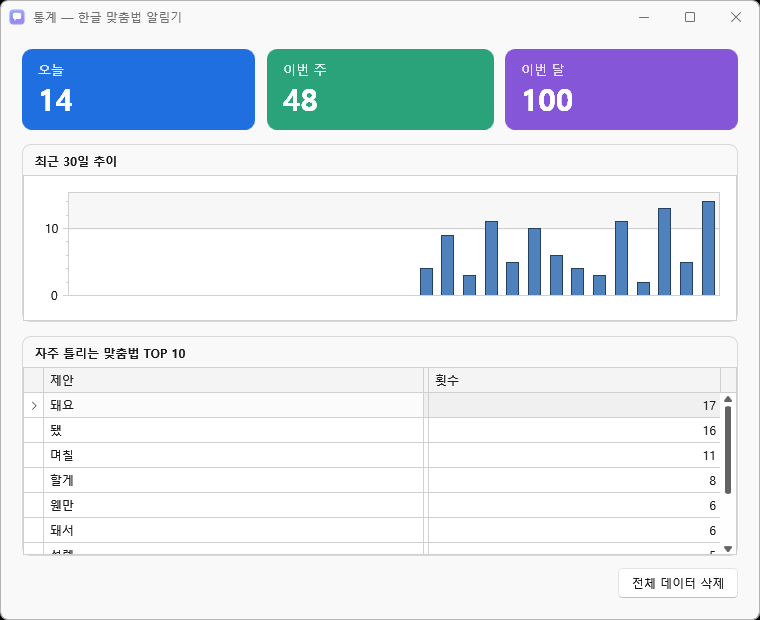
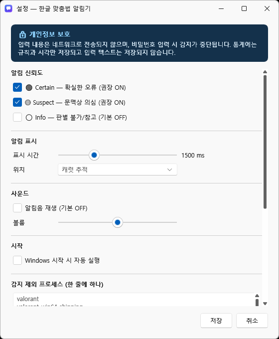

# HangulNotifier

**한글 맞춤법 실시간 알림기** — Windows 백그라운드 상주 앱  
어떤 프로그램에 타이핑해도 한글 맞춤법 오류를 캐럿 옆에 즉시 알려줍니다.



[](https://dotnet.microsoft.com/download/dotnet/8.0)
[](https://www.microsoft.com/en-us/windows)
[](https://learn.microsoft.com/en-us/dotnet/desktop/wpf/)
[](#-개발-현황)

---

## ✨ 소개

**HangulNotifier**는 Windows에서 실행되는 백그라운드 앱입니다. 메모장, Word, 웹 브라우저, VS Code 등 **어떤 프로그램에서든** 한글을 입력할 때, 맞춤법 오류를 감지하고 **캐럿(텍스트 커서) 근처에 팝업 알림으로 띄워줍니다.**

- ✅ **자동 교정 없음** — 오류를 지적하기만 하고, 텍스트를 수정하지 않습니다.
- ✅ **포커스 유지** — 알림이 뜨면서 입력 포커스를 빼앗지 않아 입력 중단이 없습니다.
- ✅ **트레이 상주** — 백그라운드에서 조용히 실행되며, 언제든 일시정지·재개 가능합니다.

---

## 🔒 개인정보 & 보안

**가장 중요한 약속:**

1. **입력 내용을 저장하지 않습니다**
   - 타이핑한 텍스트를 파일, 데이터베이스, 클라우드 어디에도 저장하지 않습니다.
   - 로컬 메모리에서만 처리하고 즉시 버립니다.
   - 통계 저장소(`stats.db`)에는 규칙ID와 감지 시각, 프로세스명만 기록합니다. **입력 텍스트 자체는 절대 저장하지 않습니다.**

2. **입력·통계는 네트워크로 전송하지 않습니다**
   - 타이핑 내용·통계·식별 정보를 외부로 보내지 않습니다. 텔레메트리·분석·자체 서버가 없습니다. 맞춤법 처리는 100% 당신의 PC 안에서만 일어납니다.
   - **유일한 예외 — 업데이트 확인(옵트인, 기본 OFF):** 설정에서 켜거나 트레이 "업데이트 확인"을 직접 누를 때만 GitHub 릴리즈에 접속해 **최신 버전 문자열만** 조회합니다. 이때도 사용자 데이터는 전송하지 않고, 자동 다운로드·설치도 하지 않습니다(새 버전이면 브라우저로 릴리즈 페이지를 열어 사용자가 직접 설치). 켜지 않으면 앱은 어떤 네트워크 통신도 하지 않습니다.

3. **비밀번호 입력란 감지 안 함**
   - 비밀번호 필드(`<input type="password">` 등)에서는 입력 감지 자체를 하지 않습니다.
   - 감시 중단 + 입력 버퍼링 안 함.

4. **로그에 입력 텍스트 없음**
   - 앱 로그 파일(`%APPDATA%\HangulNotifier\logs\`)에 사용자 입력 내용을 기록하지 않습니다.

### "키로거가 아닌 이유"

이 앱은 **전역 키보드 후킹**을 사용하므로, 초기에 "키로거" 의심을 받을 수 있습니다. 하지만 다음과 같이 **근본적으로 다릅니다:**

| 구분 | 키로거 | HangulNotifier |
|------|--------|--------|
| **입력 저장** | 파일/DB/서버로 전송 | 저장 안 함, 로컬만 처리 |
| **네트워크** | 입력을 상시 서버로 유출 | 입력 전송 0 · 업데이트 확인(옵트인, 기본 OFF)만 GitHub 접속 |
| **후킹 방식** | 주입형(`WH_KEYBOARD`) 또는 드라이버 | 비주입형(`WH_KEYBOARD_LL`) |
| **코드 주입** | 다른 프로세스 메모리에 주입 | 주입 없음 |
| **권한** | 관리자 권한 요구 | 일반 사용자 권한 |
| **소스 공개** | 숨김 | 오픈소스 (검증 가능) |

---

## ⚠️ 백신 & SmartScreen 경고 안내

### 왜 경고가 나나요?

이 앱은 **코드 서명 인증서가 없습니다.** Windows Defender SmartScreen과 일부 백신은 서명 없는 프로그램, 특히 **전역 키보드 후킹을 쓰는 앱**을 의심하는 것이 정책입니다. 이는 정상적인 보안 설정입니다.

### 안전한 이유

1. **행위 기반 검증**
   - 입력 내용 저장/전송 없음(키로거의 1순위 신호 제거)
   - 네트워크는 기본적으로 사용 안 함 — 사용자가 켠 **업데이트 확인**에서만 GitHub에 접속해 버전을 조회(입력 데이터 전송 없음, 자동 다운로드·실행 없음)
   - 프로세스 주입/메모리 조작 없음
   - 관리자 권한 미요구(`asInvoker`)

2. **투명성**
   - 오픈소스로 공개되어 소스 코드 검증 가능
   - 메타데이터, 아이콘, 버전 정보 완전 포함

### SmartScreen 경고 무시하기

첫 실행 시 SmartScreen이 경고하면:
1. 경고 대화상자에서 **"추가 정보"** 클릭
2. **"실행"** 버튼 클릭

이후 같은 버전은 경고하지 않습니다.

### 백신 제외 설정 (권장)

Windows Defender 또는 설치된 백신에서 `HangulNotifier.exe`를 제외(whitelist)하면 더 빠릅니다:
- **Windows Defender**: 설정 > 바이러스 및 위협 방지 > 관리 설정 > 제외 항목 추가

---

## 🎯 주요 기능

- **실시간 감지**: 타이핑 중 맞춤법 오류를 즉시 감지
- **캐럿 추적 알림**: 오류 위치 옆에 팝업으로 표시 (입력 중단 없음)
- **신뢰도별 알림**
  - 🔴 **Certain** (확실함): 띄어쓰기 오류, 확정 오타 등
  - 🟡 **Suspect** (의심): 문맥에 따라 틀릴 수 있는 표현
  - ⚪ **Info** (정보성): 참고만 필요한 항목
- **통계 대시보드**: 일별/주별/월별 감지 통계 조회
- **트레이 상주**: 시스템 트레이에서 일시정지/재개/설정 접근
- **사용자 규칙**: 개인 맞춤법 규칙 추가 가능
- **신뢰도별 제어**: 설정에서 각 수준의 알림 ON/OFF 선택
- **업데이트 확인(옵트인)**: 켜면 GitHub 릴리즈에서 새 버전만 확인해 알림 — 자동 다운로드·설치 없이 브라우저로 안내 (기본 OFF)

---

## 📸 스크린샷

DevExpress WPF 기반의 **프리미엄 라이트 UI** — 커스텀 디자인 시스템(카드 레이아웃, 인디고–바이올렛 강조색, 벡터 아이콘, 커스텀 토글·슬라이더)으로 통일감 있게 마감했습니다.

### 실시간 알림 (캐럿 옆 팝업)
입력 중 오류가 감지되면 커서 근처에 살짝 뜹니다. 포커스를 빼앗지 않아 입력이 끊기지 않습니다. 신뢰도별 좌측 색상 바로 심각도를 구분합니다.



### 통계 대시보드
오늘/이번 주/이번 달 감지 횟수를 그라데이션 카드로 요약하고, 최근 30일 추이와 자주 틀리는 맞춤법 TOP 10을 함께 보여줍니다. (입력 텍스트는 저장하지 않고 규칙ID·시각·프로세스명만 기록)



### 설정
신뢰도 수준별 알림 ON/OFF(토글 스위치), 표시 시간·위치, 자동 실행, 감지 제외 프로세스, 맞춤법 규칙 개별 설정을 섹션 카드로 정리했습니다.



---

## 📝 감지 예시

실제 감지하는 주요 오류:

| 오류 입력 | 올바른 표기 | 설명 | 신뢰도 |
|----------|-----------|------|--------|
| `됬` | `됐` | '되었다'의 준말은 '됐다' | Certain |
| `되요` | `돼요` | '되어요'의 준말이라 '돼요'. ('하/해' 대입: '해요'가 자연스러우면 '돼요') | Certain |
| `되서` | `돼서` | '되어서'의 준말. ('해서'가 자연스러우면 '돼서') | Certain |
| `되야` | `돼야` | '되어야'의 준말. ('해야'가 자연스러우면 '돼야') | Certain |
| `돼고` | `되고` | 어미 앞 어간은 '되'. ('돼=되+어'라 어미가 붙으면 '되') | Certain |
| `않되` | `안 돼` | 부사 '안'은 띄어 씁니다. ('않'은 '-지 않다'에만) | Certain |
| `몇일` | `며칠` | 어떤 경우에도 '몇일'은 없음 | Certain |
| `오랫만` | `오랜만` | '오래간만'의 준말이라 '오랜만' | Certain |
| `금새` | `금세` | '금시에'의 준말이라 '금세' | Certain |
| `설레임` | `설렘` | 기본형이 '설레다'라 명사는 '설렘' | Certain |
| `희안` | `희한` | '희한(稀罕)하다'가 바른 표기 | Certain |
| `어의없` | `어이없` | '어이없다'가 바른 표기 | Certain |
| `됀다` | `된다` | '됀'은 존재하지 않는 음절(항상 '된'의 오타) | Certain |
| `어떻해` | `어떡해` | '어떻게 해'의 준말은 '어떡해' | Certain |
| `왠일` | `웬일` | '웬일'이 바른 표기 ('왠'은 '왠지'에만) | Certain |
| `담궈` | `담가` | '담그다'의 활용은 '담가' | Certain |
| `오랜동안` | `오랫동안` | '오랫동안'이 바른 표기 | Certain |
| `아니예요` | `아니에요` | '아니다'는 '아니에요' | Certain |
| `되` (문장 끝) | `돼` | 문장을 끝맺을 땐 '돼' | Suspect |
| `안` (앞에 '지') | `않` | '-지 안'이 아니라 '-지 않' | Suspect |

이 외에도 총 **51종**의 규칙(Certain 45 · Suspect 4 · Info 2)을 감지하며, `%APPDATA%\HangulNotifier\user-rules.json`으로 규칙을 직접 추가할 수 있습니다.

### 되/돼 구분 원리

가장 흔한 오류는 '되'와 '돼' 혼동입니다. HangulNotifier는 다음 원리로 구분합니다:

```
돼 = 되 + 어

예:
- 되어요 → 돼요 ('해요'처럼 자연스러움)
- 되어서 → 돼서
- 되어야 → 돼야
- 되고 → 되고 (어미가 붙으므로 '되'는 그대로)

자동 검사법: '되' 자리에 '하'를, '돼' 자리에 '해'를 넣어보기
- 하고 vs 해고? → '하고'가 맞으므로 '되고'
- 해도 vs 하도? → '해도'가 맞으므로 '돼도'
```

---

## 🛠 기술 스택

| 계층 | 기술 |
|------|------|
| **런타임** | .NET 8 (`net8.0-windows`) |
| **UI 프레임워크** | WPF + DevExpress WPF |
| **MVVM** | DevExpress.Mvvm + CodeGenerators (`[GenerateViewModel]`, `[GenerateProperty]`) |
| **테마/디자인** | DevExpress Win11Light + 커스텀 디자인 시스템 (`Themes/DesignSystem.xaml`) — Premium Light, Indigo–Violet 강조 |
| **차트/그리드** | DevExpress.Wpf ChartControl, GridControl |
| **트레이** | H.NotifyIcon.Wpf |
| **DB** | Microsoft.Data.Sqlite (통계 저장소) |
| **DI/호스팅** | Microsoft.Extensions.Hosting |
| **로깅** | Serilog (롤링 파일 싱크) |
| **설정** | System.Text.Json |
| **테스트** | xUnit + FluentAssertions |

### 아키텍처 특징

- **Core 계층 순수성**: 맞춤법 엔진(`HangulAutomata`, `WordBuffer`, `RuleEngine`)은 .NET 8 표준만 사용 → 100% 테스트 가능, 플랫폼 의존성 0
- **Platform 계층 격리**: 모든 P/Invoke와 Windows API를 별도 프로젝트로 분리
- **비차단 후킹**: 키보드 후킹 콜백은 10ms 이내 반환, 실제 처리는 워커 스레드에서 비동기 수행

---

## 🏗 빌드 & 설치

### 요구사항

- **Windows 10 또는 11** (64-bit)
- **.NET 8 SDK** ([download](https://dotnet.microsoft.com/download/dotnet/8.0))
- **.NET 8 Desktop Runtime** (설치 시 필요)

### 개발자용 빌드

```bash
# 솔루션 빌드
dotnet build

# 테스트 실행
dotnet test

# Release 빌드
dotnet build -c Release
```

### 배포

#### 0. 자동 릴리즈 (권장)

버전 태그를 push하면 **GitHub Actions**(`.github/workflows/release.yml`)가 빌드·테스트·인스톨러(Inno Setup 7)·SHA256·릴리즈 발행을 자동 수행합니다.

```bash
# 1) Directory.Build.props 의 VersionPrefix 와 HangulNotifier_installer.iss 의 MyAppVersion 을
#    새 버전으로 올려 커밋
# 2) 버전 태그 push
git tag v0.3.0
git push origin v0.3.0
```

- 태그(`vX.Y.Z`)와 두 파일의 버전이 일치해야 하며(불일치 시 워크플로 실패), 릴리즈에 인스톨러와 `*.exe.sha256` 체크섬이 첨부됩니다.
- `-`가 붙은 태그(예: `v0.3.0-beta`)는 자동으로 프리릴리즈로 발행됩니다.
- Actions 탭의 수동 실행(`workflow_dispatch`)은 발행 없이 빌드/테스트/아티팩트만 만드는 드라이런입니다.

아래 수동 절차는 로컬에서 직접 빌드할 때만 필요합니다.

#### 1. 단일 파일 실행 파일 생성

```bash
dotnet publish src/HangulNotifier.App/HangulNotifier.App.csproj \
  -c Release -r win-x64 \
  -p:PublishSingleFile=true \
  -p:EnableCompressionInSingleFile=false \
  -p:SelfContained=false \
  -p:PublishProfile=win-x64
```

생성 위치:
- `src/HangulNotifier.App/bin/Release/publish/HangulNotifier.exe` (~115MB)
- `src/HangulNotifier.App/bin/Release/publish/e_sqlite3.dll` (SQLite 통계 DB)

#### 2. Inno Setup 인스톨러 빌드

**요구사항:** [Inno Setup 7](https://jrsoftware.org/isdl.php) 설치

```bash
# Inno Setup 7 로 HangulNotifier_installer.iss 컴파일
ISCC HangulNotifier_installer.iss
# 출력: dist/HangulNotifier-Setup-<버전>.exe
```

**인스톨러 특징:**
- Per-User 설치 (관리자 권한 불필요)
- .NET 8 Desktop Runtime 자동 확인 및 설치 안내
- 시작 메뉴 바로가기, 제거 기능 포함

#### 3. 최종 사용자 설치

1. [Releases](https://github.com/BaeTab/hangeul_detect/releases/latest)에서 **`HangulNotifier-Setup-<버전>.exe`** 다운로드 후 실행
2. (선택) 무결성 검증 — 첨부된 `*.exe.sha256` 값과 다운로드 파일의 SHA256을 대조
3. 설치 마법사 따라가기 (기본값 권장)
4. 첫 실행 시 SmartScreen 경고 시 "추가 정보" → "실행" 클릭
5. 시스템 트레이에 앱 아이콘 표시

---

## 개발 현황

**상태:** v0.2.0 코드 완료

- ✅ Phase 0: 솔루션 구조, 패키지 설정 완료
- ✅ Phase 1: Core(두벌식 오토마타/버퍼/규칙 엔진 — 테스트 139개 전부 통과, 오토마타 커버리지 100%) 완료
- ✅ Phase 2: Platform(전역 키보드 후킹/IME 한글모드 판정/비밀번호·보안 필드 3중 차단) 완료
- ✅ Phase 3: 오버레이 UI (캐럿 추적 클릭-스루 오버레이, 신뢰도 색상바) 완료
- ✅ Phase 4: 통합 (트레이 상주, DevExpress 설정/통계 대시보드) 완료
- ✅ Phase 5: 마감 (단일 파일 게시 + Inno Setup 인스톨러) 완료

**v0.2.0 핵심 수정:** 최신 TSF 앱(크롬/카톡/UWP/VS)에서 감지가 전혀 되지 않던 교차 프로세스 IME 판정 버그 수정 — 이제 모든 앱에서 동작합니다.

**검증 현황:** 실기기 구동 검증 완료 (앱 실행, 전역 후킹 설치, 오버레이/통계/설정 렌더링). 실제 여러 프로그램에서의 타이핑 현장 검증은 진행 중입니다.

---

## 📌 알려진 제약

1. **최신 앱의 한/영 상태 추적 방식**
   크롬·카카오톡·UWP·Visual Studio 등 최신 TSF 기반 앱은 외부 프로세스에서 IME 한/영 상태를 직접 읽을 수 있는 안전한 표준 API가 없습니다. 그래서 이 앱은 전역 후킹이 직접 보는 **한/영 토글키로 상태를 추적**합니다(기본값: 한글 ON). Win+Space나 언어바로 언어를 바꾸면 드물게 한/영 인식이 어긋날 수 있는데, 이때 **한/영 키를 한 번 누르면 즉시 재동기화**됩니다. 클래식(Win32) 앱에서는 IMM에서 확답을 얻어 정확히 판정합니다.

2. **관리자 권한 앱 미지원**
   - 작업 관리자, 레지스트리 편집기, 관리자 모드 명령 프롬프트 등 관리자 권한으로 실행되는 앱에서는 동작하지 않습니다.
   - Windows 보안 정책에 의한 제약입니다.

3. **안티치트 게임 제외**
   - 일부 게임(발로란트 등 Riot Vanguard 탑재)은 전역 후킹을 차단하거나 앱을 강제 종료할 수 있습니다.
   - 게임 프로세스는 기본적으로 감지 대상에서 제외됩니다.

4. **백신 오탐 (서명 없음)**
   - 코드 서명 인증서가 없어 첫 실행 시 SmartScreen 경고가 나타날 수 있습니다.
   - "추가 정보 → 실행"으로 무시 가능하며, 오픈소스 공개로 검증 가능합니다.

5. **일부 UWP/Store 앱 캐럿 미감지**
   - Microsoft Store 앱 중 일부는 표준 API로 캐럿 위치를 가져올 수 없습니다.
   - 이 경우 고정 위치에 알림을 표시하는 폴백 모드로 동작합니다.

---

## 🤝 기여 방법

기여를 환영합니다! 특히 **자주 틀리는 맞춤법 규칙 추가**에 도움을 주시면 좋습니다.

### 개발 환경 준비
```bash
git clone https://github.com/BaeTab/hangeul_detect.git
cd hangeul_detect
dotnet build
dotnet test        # 139개 테스트가 모두 통과해야 합니다
```

### 맞춤법 규칙 추가하기
규칙은 JSON으로 정의됩니다. 내장 규칙은 `src/HangulNotifier.Core/Rules/{certain,suspect,info}.json`에, 개인 규칙은 `%APPDATA%\HangulNotifier\user-rules.json`에 추가합니다.

규칙 한 개의 형식:
```json
{
  "id": "고유_식별자",
  "pattern": "됀",
  "suggestion": "된",
  "message": "'됀'은 존재하지 않는 음절입니다. 언제나 '된'.",
  "level": "Certain",
  "previousWordPattern": "선택: 앞 어절이 이 정규식과 일치할 때만",
  "previousWordNotPattern": "선택: 앞 어절이 이 정규식과 일치하지 않을 때만"
}
```
- `pattern`은 정규식입니다. 어절 끝을 지정하려면 `$`를 씁니다(예: `되요$`).
- `level`: `Certain`(확실) · `Suspect`(문맥 의심) · `Info`(참고, 기본 OFF).

### 규칙 기여 원칙 (중요)
- **오탐 제로가 최우선입니다.** 애매하면 `Suspect`나 `Info`로, 절대 틀릴 수 없는 표기만 `Certain`으로.
- 규칙을 추가하면 `tests/HangulNotifier.Rules.Tests/RuleEngineTests.cs`에 **감지 테스트와 오탐 방지 테스트를 쌍으로** 추가하세요. (올바른 표기가 걸리지 않는지 반드시 검증)

### PR 규칙
- 커밋 메시지 본문은 한글, prefix는 영어(`feat:`, `fix:`, `docs:` 등).
- Core 계층은 순수(플랫폼 의존 0)를 유지합니다. Win32/WPF 코드는 Platform/App 계층에만.

---

## 📄 라이선스

개인 프로젝트. 라이선스는 추후 명시 예정입니다.

---

**Made with ❤️ by H.Soft, Jeju**

HangulNotifier는 한글 사용자의 쾌적한 타이핑 경험을 위해 만들어졌습니다.
